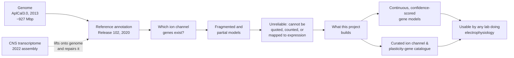

# Extended introduction — why *Aplysia*'s ion channel genes are hard to read, and what this project does about it

> **Who this is for.** You do not need any background in neuroscience, genetics, or programming. If you have never heard the words *ion channel*, *genome*, or *transcriptome*, this document starts from zero. Every resource named here is linked and free to open.
>
> **How to use it.** Sections 1 to 4 are the background. Section 5 is the actual research question. Sections 8 to 10 are a glossary and a reading list. Read 1 to 5 and you will know what this project is for.

---

## 1. The animal

*Aplysia californica*, the California sea hare, is a marine slug that lives on the Pacific coast of North America. It is a few centimetres long, a soft-bodied brown-grey mottled animal, and from the outside it is unremarkable. It eats algae, it is eaten by fish, and it is not obviously remarkable in any way.

It is one of the most intensively studied animals in biology, and the reason is a single physical property: **its nerve cells are enormous and individually identifiable.** Not "large" in a relative sense. An *Aplysia* neuron can be up to a millimetre across and, unusually, contains nearly two million times more RNA than a typical human neuron. A researcher can dissect the animal, find one specific nerve cell with a microscope and tweezers, and — because the same cell sits in the same anatomical spot in every individual — identify that same cell again in the next animal, the next month, in the next lab.

This is unusual. In a mouse or a human you cannot pick out one known neuron by eye. In *Aplysia* you can. That single fact is what makes decades of precise neuroscience possible.

## 2. The nervous system, in plain terms

An animal's nervous system is a network of cells called **neurons** that pass electrical signals around. A neuron has a membrane around it, and the inside of that membrane carries a charge. Sockets work by letting a charged particle flow; a neuron works much the same way, and it is the flow of these charged particles through protein channels in the membrane that produces a signal.

An electrical signal travels in waves. Where two neurons touch, one releases a chemical, the chemical binds to a protein on the next neuron, and that opens channels, which changes the charge, which can start a wave in the next cell. Chains of neurons wired this way produce behaviour.

Somewhat surprisingly, the *Aplysia* nervous system is not simple in terms of cell count. It has on the order of a hundred thousand neurons. What makes it tractable is not the number but the **naming**: because the cells are individually identifiable, decades of work have produced a map in which particular cells are called B31, B32, B63, B51, B64 and so on. Two researchers in 1986 studying feeding behaviour in different laboratories will be looking at the same physical cell when they say "B63".

The cells that matter for this project are in the **buccal ganglia** — two small clusters of nerve cells near the mouth, which together generate the rhythmic pattern of movements the animal uses to scrape algae off rock with a tooth-like structure called the radula.

## 3. The vocabulary this project needs

### Genes, genomes, and transcriptomes

A **gene** is a stretch of DNA that gets copied into a working instruction for building a protein. A **genome** is the complete set of DNA for an organism. A **transcriptome** is the complete set of RNA *present at one moment* — which is to say, a snapshot of which genes are switched on, and how much.

The distinction matters because of a practical problem: **a genome is a set of instructions; a transcriptome is evidence that the instructions were used.** And the *Aplysia* genome is a famously imperfect record. The reference version was assembled in 2013, and the automated annotation on top of it dates from 2020. Compare that with the human genome annotation, which has been revised many times since its first release.

### Ion channels

**Ion channels** are proteins that form holes through the neuronal membrane. When a specific kind of channel opens, a specific charged particle flows in a specific direction, and the membrane's charge changes by a specific amount. Different channels produce different effects: some make a neuron easier to excite, some make it harder, some make it fire in bursts, some make it stop firing.

Channel behaviour depends on two things: *which* channels a cell has, and *how many* of each. A neuron that has fewer of a particular kind of channel is, mechanically, a different neuron. So a great deal of what determines how an animal behaves reduces, at the bottom, to: **which channel genes are switched on, in which cell, and at what level.**

### What goes wrong, and why it matters

When a genome annotation is poor, a gene is represented as a handful of disconnected fragments instead of one continuous piece. Reading across such a fragment is like reading a book with half the pages torn out: you can often guess the plot, but you cannot quote a sentence reliably, you cannot count the chapters, and you cannot be certain you are not missing half the story.

This is not a hypothetical problem for *Aplysia*. Research groups working on *Aplysia* neuropeptides as recently as 2023 and 2025 have reported having to search the genome annotation **and** a separate transcriptome assembly, because the genome records were incomplete. In one case the authors state plainly that the three relevant messenger RNA entries in the public database were incomplete, and that complete sequences had to be recovered from elsewhere. That kind of workaround is normal practice in the field and it slows everyone down.

## 4. Why this project is worth doing

A working gene model, with the ion channel genes curated by hand and each one assigned a confidence level, removes a step that currently happens privately and repeatedly in individual laboratories. It makes the *Aplysia* ion channel repertoire a shared, queryable resource instead of a set of private reconstructions.

It also has a specific downstream purpose. One laboratory — the one led by Professor Abraham (Avi) Susswein at Bar-Ilan University — has spent four decades establishing that *Aplysia* can learn that a particular food is inedible, and has traced the memory signal to specific transcription factors activated **in the buccal ganglia**. Their own stated next step is to identify the "memory-blocking proteins" that stop new memories forming. Doing that requires a correct gene model for the buccal ganglia. This project is a prerequisite for that work, and it does not require anyone from that laboratory to do it.

## 5. The research question

> **Is the public record of *Aplysia* ion channel genes incomplete, and can it be corrected?**

More precisely, this project asks four things:

1. **How bad is the current annotation?** Measure it. Gene models are scored on whether they are complete (BUSCO completeness) and how long their coding sequences are.
2. **Can it be improved?** Take the 2022 transcriptome and use it to repair the annotation, following a published method.
3. **Which genes are ion channels, and how confident can we be?** Identify them by protein-domain signature, predict their membrane topology, and have two people independently review the list, reporting their agreement.
4. **What changes across species?** Compare the resulting gene count against the closest related molluscs.

**What the project will not do.** It will not produce a new genome assembly — the people who generated the raw sequencing data hold those reads and are better placed to do it. It will not claim a complete catalogue of ion channels. And it will not make any claim about what those channels *do*; that requires recording from live neurons, which is a different kind of work entirely.

## 6. What "open data" means here

Every input is publicly downloadable, with no application process and no cost:

| Input | Where | What it is |
|---|---|---|
| Genome | [NCBI GCA_000002075.2](https://www.ncbi.nlm.nih.gov/datasets/genome/GCA_000002075.2/) | The 2013 assembly |
| Annotation history | [National Resource for *Aplysia*](https://aplysia.earth.miami.edu/mission-and-scientific-importance/scientific-importance/index.html) | Official statement of the reference release |
| Genome project | [neurobase.rc.ufl.edu/aplysia](https://neurobase.rc.ufl.edu/aplysia) | Who is working on what |
| Improved transcriptome | [AplysiaTools](http://aplysiatools.org/) | BLAST search and downloads |
| The transcriptome paper | [PNAS 2022](https://www.pnas.org/doi/10.1073/pnas.2122301119) | How it was built |
| The repair method | [Methods Mol Biol 2024](https://pmc.ncbi.nlm.nih.gov/articles/PMC11112408/) | The pipeline this project follows |
| Annotation benchmarking | [Genome Research 2025](https://pmc.ncbi.nlm.nih.gov/articles/PMC12047660/) | Which tools are currently best |
| Closest relative genomes | [*Elysia timida*](https://d-nb.info/1352061384/34), [*Euprymna scolopes*](https://elifesciences.org/articles/107393) | Comparison points |
| Channel isoform precedent | [Sci Rep 2023](https://www.nature.com/articles/s41598-023-47573-z) | Why isoform structure matters |

## 7. A note on statistics, since the methods file is unusually explicit about it

Statistical testing in a resource project is mostly about not overclaiming. The methods file for this project states its tests in advance, and it commits to three things worth knowing even as a lay reader:

- **Effect size, not just a p-value.** A p-value can be made small by measuring a trivial difference in a huge sample. The methods file therefore requires the size of the effect to be reported alongside any p-value.
- **A negative control.** If the numbers improve when they shouldn't, the improvement is meaningless. The project checks this against housekeeping genes that should not be affected.
- **A failure is a publishable result.** If the corrected annotation does not measurably beat the old one, that is reported. The method is stated in advance precisely so that it cannot be quietly changed once the answer is known.

## 8. Glossary

| Term | Meaning |
|---|---|
| **Aplysia** | The California sea hare, *Aplysia californica* |
| **Neuron** | A cell that passes electrical signals |
| **Ion channel** | A membrane protein forming a hole that a charged particle flows through |
| **Gene** | A DNA sequence that produces a protein |
| **Genome** | All of an organism's DNA |
| **Transcriptome** | All of the RNA present at one moment; a snapshot of gene activity |
| **Gene model** | The computer's description of a gene: where it starts, ends, and which parts are spliced out |
| **Exon** | A retained piece of a gene |
| **BUSCO** | A completeness score measuring how many expected genes are found intact |
| **Ortholog** | A gene in one species corresponding to a gene in another, inherited from a common ancestor |
| **Orthology** | The process of identifying such correspondences |
| **FASTA / GFF3** | The two plain-text file formats genes are distributed in |
| **Container (Docker)** | A packaged copy of all the software, so results are reproducible |
| **DOI** | A permanent, citable web address for a dataset or paper |

## 9. Reading further

**Start here, in order.** Each is free and requires no registration.

1. [Aplysia genome project page](https://neurobase.rc.ufl.edu/aplysia) — what the genome is and who built it
2. [National Resource for *Aplysia*](https://aplysia.earth.miami.edu/) — the only place in the world that breeds this species for research
3. [The 2022 transcriptome paper, PNAS](https://www.pnas.org/doi/10.1073/pnas.2122301119) — open-access, well written, a good model for what a computational paper should look like
4. [Susswein's laboratory page](https://life-sciences.biu.ac.il/en/node/611) — the research programme this project supports
5. [Susswein, Schwarz & Feldman 1986, *J Neurosci*](https://www.jneurosci.org/content/jneuro/6/5/1513) — the original learning-that-food-is-inedible result, open access
6. [Learning that food is inedible, 2016 *eLife*](https://elifesciences.org/articles/17769) — the sleep-dependence work whose next step this project enables
7. [GEO GSE79231](https://www.ncbi.nlm.nih.gov/geo/query/acc.cgi?acc=GSE79231) — the RNA-sequencing dataset the *other* project in this programme uses
8. [ModelDB 65412](https://modeldb.science/65412) — a working computational model of the feeding circuit

**Learning the tools, gently.** [The Bioconductor book](https://bioconductor.org/help/books/) and [the R for Data Science book](https://r4ds.hadley.nz/) are both free online. [Rosalind](https://rosalind.info) teaches bioinformatics through puzzles.

## 10. If you want to check the work rather than trust it

Every claim in this programme is checkable. The pre-registered methods file is committed to the repository **before** any analysis is run, and a continuous-integration check fails the build if any analysis artefact appears with an earlier commit date. The timestamp is public evidence that the analysis was specified in advance.

To check any number in the eventual paper: the input files have published checksums, the analysis runs in a pinned container with a recorded image digest, and a single script regenerates every figure from a clean checkout. If a figure cannot be reproduced, that is a defect, and the build fails.
